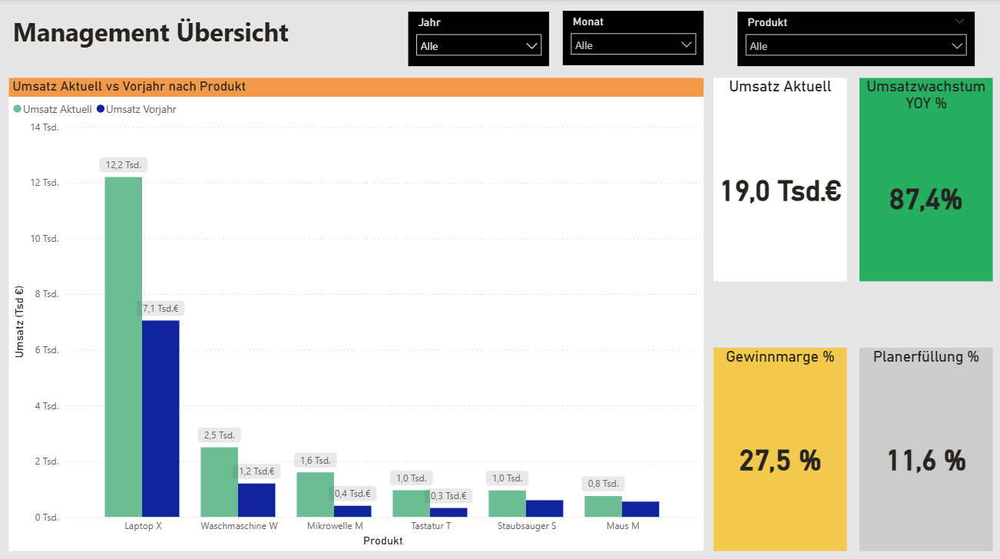
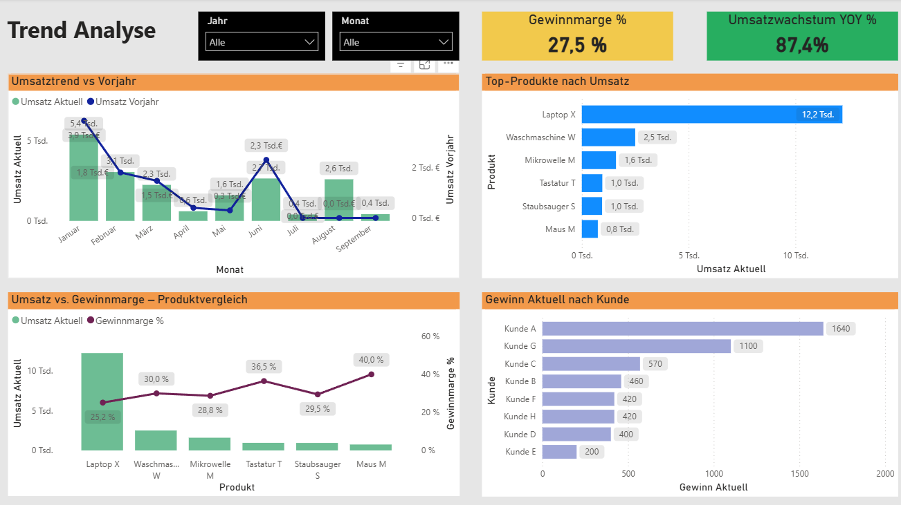

# 📊 Sales Performance Dashboard (Power BI)

> Interactive Power BI dashboard for analyzing sales performance, profitability and budget vs actuals.

---

## 🚀 Project Summary
This project demonstrates the development of a business-oriented Power BI dashboard designed for management decision-making.

It provides clear insights into revenue trends, profitability and performance against targets.

---

## 🎯 Key Insights
- Strong revenue growth driven by top-performing products  
- Profit margin variations across product categories  
- Gap between actual performance and planned targets  
- Clear identification of underperforming segments  

---

## ⚙️ Dashboard Features
✔ Revenue (Current vs Previous Year)  
✔ Year-over-Year Growth (YoY %)  
✔ Profit Margin Analysis  
✔ Budget vs Actual Comparison  
✔ KPI Status (Traffic Light Logic)  
✔ Product-Level Breakdown  

---

## 🖼️ Dashboard Preview

### 📌 Management Overview

### 📈 Trend Analysis

---

## 🛠️ Tech Stack
- **Power BI**
- **DAX (basic measures)**
- **Data Modeling (Fact & Dimension Tables)**

---

## 🧠 What I Learned
- Structuring data models for reporting  
- Building management-focused dashboards  
- Implementing YoY and KPI calculations  
- Designing clear and intuitive visuals  

---

## 📂 Project File
- `Sales_Performance_Reporting.pbix`
